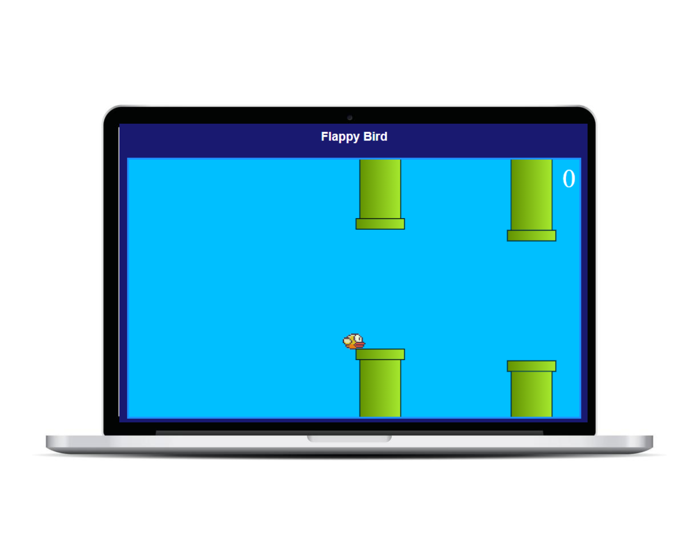

# Jogo Flappy Bird

## Descrição

Este repositório contém o código-fonte do jogo Flappy Bird desenvolvido em JavaScript, HTML e CSS. O objetivo do jogo é controlar um pássaro e fazê-lo desviar das barreiras, acumulando pontos no processo. O jogo é controlado pelo uso da tecla Espaço do teclado.

## Tecnologias Utilizadas

- JavaScript
- HTML
- CSS

## Como Jogar

1. Clone este repositório em sua máquina local.
2. Abra o arquivo index.html em um navegador da web
3. Pressione a tecla Espaço para fazer o pássaro subir. Por padrão, o pássaro desce automaticamente.
4. Desvie das barreiras passando pelo espaço entre elas.
5. Continue desviando das barreiras para acumular pontos. Cada vez que você passa por uma barreira, você ganha um ponto.
6. Se o pássaro colidir com uma barreira, a contagem de pontos é finalizada. Atualize a página para jogar novamente.

## Requisitos do Jogo

- Um navegador da web moderno com suporte a JavaScript.

## Contribuindo

Se você deseja contribuir com este projeto, por favor, faça um fork do repositório e envie um pull request com suas alterações.
